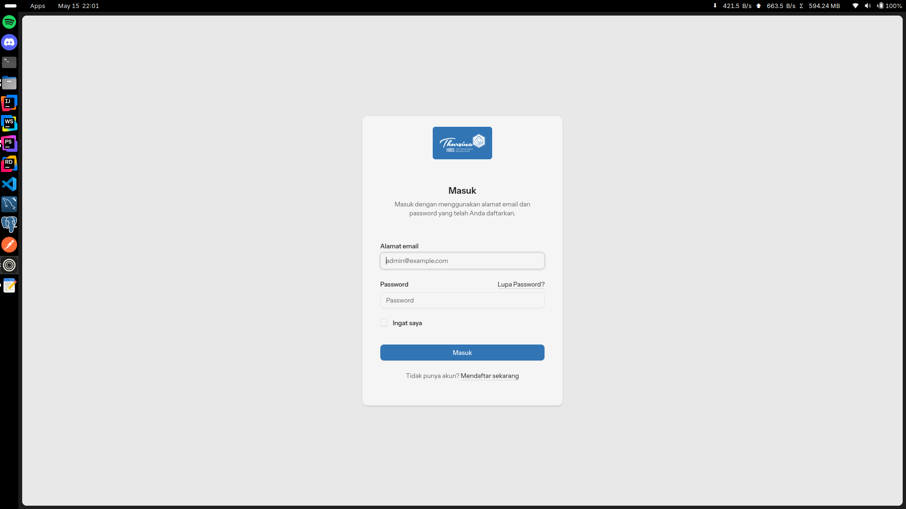

# Vincent Chandra Trie Novan

#### Laravel 12 Starter Kit + React (Inertia)
#### Database MySQL

#### Panduan Konfigurasi
1. Jalankan XAMPP/LAMPP
2. Import database mySQL dari file `~/paket-santri_db.sql` atau direktori (./sim_rsabhk_db.sql)
3. Buka folder `paket-santri` yang telah menggunakan Text Editor
5. Buka command (Terminal) (*pastikan direktori folder sesuai) dan jalankan perintah `composer install && npm install`
6. cp `.env.example` -> `.env` lalu edit dan sesuaikan bagian database di file `.env`
7. Jalankan perintah "php artisan key:generate, lalu `composesr run dev`
8. Aplikasi berhasil dibuka di server lokal

#### Login Admin
email: admin@example.com
password: password

#### Login User
email: johndoe@example.com
password: password

### Screenshoot
#### Halaman Dashboard

#### Halaman Paket List

#### Halaman Manajemen Hak Akses

#### Halaman Auth Login User

